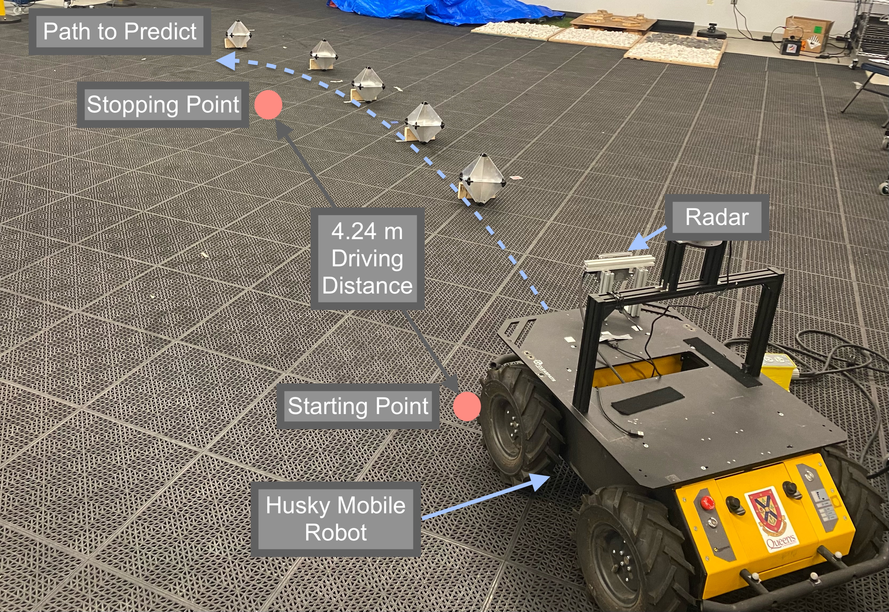

# radar-localization

This repository has the necessary code to interface with the ARS408 radar unit via CAN and stream real time data, perform DBSCAN clustering on the radar point cloud for waypoint landmark prediction, multi-object tracking through a Kalman Filter, and closed-loop automomous control using Model Predictive Control with Feedback Linearization. 

All software was written by Dean Sacoransky using ROS Melodic and Python 2.7, with the exception of the Pathfollowing Controller node which was written by Michael Fader.

The source code can be found in directory `radar-localization/src/ros_radar_configurator/radar_algorithm/src`

The file containing code that runs DBSCAN is `dbscan.py` and the multi-object tracking system (Kalman filter and data association) is `kalman_filter.py`.

## Hardware Setup: Radar, CAN, Husky

The radar unit is mounted to a Clearpath Husky A200 Mobile robot. Videos of the system in simulation can be viewed in the `.webm` files. The ARS408 radar must be connected to a 12V power supply and CAN adapter. For this project, we use the Intrepid ValueCAN4 adapter.  Please follow the instructions linked below to install the required SocketCAN software: <https://github.com/intrepidcs/icsscand>

## Software Instructions

Run the Husky software, base robot and joystick: See husky documentation: <https://github.com/husky/husky>

Alternatively, you can play the rosbags containing all necessary data for this system (allows you to avoid hardware setup).

```bash
cd radar-localization
catkin build
source devel/setup.bash
rosbag play radar-and-robot-data.bag
```

In another terminal, run the radar localization system (radar interfacing -> dbscan -> Kalman filter).

```bash
cd radar-localization
catkin build
source devel/setup.bash
roslaunch radar_algorithm localization.launch
```

For the Kalman filter localization error calculation (based on my ground truth data) and covariance plots, run the following scripts which creates plots as seen in the plots folder.

```bash
cd radar-localization
catkin build
source devel/setup.bash
rosrun radar_algorithm cov_plot.py 
```

In another terminal, run the path following control node (navigation and husky must be launched beforehand).

```bash
cd radar-localization
catkin build
source devel/setup.bash
roslaunch radar_algorithm control.launch 
```

In a seperate terminal:

```bash
rostopic pub start_trigger std_msgs/Empty "{}" --once
```

We Install roadside reflectors to aid path following, as seen below.



And then use the DBSCAN clustering algorithm to segment noisy background detections from the desired reflector detections. An effective detection of roadside reflectors will aid in lateral lane localization.
